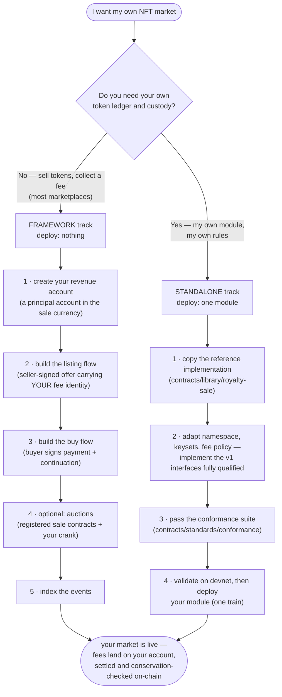
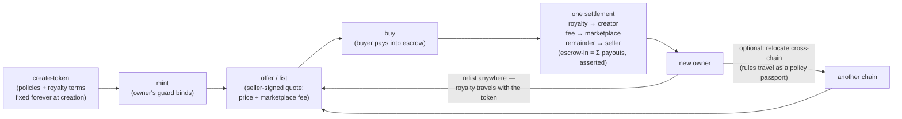

# Launch your NFT marketplace — quickstart

You run a business and want your own NFT market on Kadena (KDA-CE). This page
is the whole onboarding journey in plain language. Deep detail lives in
[TECHNICAL.md](TECHNICAL.md) (section 10 is the field-by-field integration
surface); the deploy procedure lives in [DEPLOYMENT.md](DEPLOYMENT.md).

There are **two ways to be a marketplace**, both built on PCO-published,
frozen on-chain interfaces. Most businesses want the first.

## Track 1 — a marketplace on the framework (deploy nothing)

In the shared-ledger framework, tokens live in one hardened ledger and the
policy-manager settles every sale. A marketplace is **not a contract** — it is:

1. **a fee identity**: your revenue account, named in every seller-signed
   listing (the quote). The settlement pays your cut automatically;
2. optionally **an auction venue**: listings may name the registered
   `conventional-auction` / `dutch-auction` for price discovery, and your
   service runs the settlement crank;
3. **a frontend** that builds the offer and buy transactions.

You write no Pact, custody no tokens, and touch no settlement math. The
conservation assert (`escrow-in = Σ payouts`) and the creator's royalty are
enforced by the framework on every sale, including yours.

### The steps

1. **Create your revenue account** in the sale currency (e.g. `coin`). It must
   be a **principal account** (`k:`/`w:`/`c:`). At listing time, always fetch
   its **live guard** from the fungible's `details` — never hand-build one.
2. **Listing (fixed price)**: your frontend builds the seller's offer — the
   ledger's `sale` defpact — with a quote naming the price, the seller's payout
   principal, and *your* `fee-account` / `fee-guard` / `fee-bps` (≤ 1000 bps —
   the framework's cap; charge less as policy). Economics bind in state at
   offer, signed by the seller. Nothing in the later buy transaction can change
   them.
3. **Buying**: the buyer signs exactly two things — a `TRANSFER` of the price
   into the sale's escrow, and the buy continuation with their own account.
   The manager settles royalty + your fee + seller remainder in one
   conservation-asserted step; your fee lands on your account with no
   marketplace code in the loop.
4. **Auctions (optional)**: the same quote with `price: 0.0` and
   `sale-contract` naming a **governance-registered** auction; the seller then
   creates the auction (schedule / reserve / increment). Anyone may settle a
   finished auction — your crank does it as a service. Your fee is carved from
   the winning bid; auctions are not a royalty bypass.
5. **Index the events**: `QUOTE` and `SETTLED` from the policy-manager;
   `TOKEN`, `SALE`, `TRANSFER`, `RECONCILE`, `SUPPLY` from the ledger;
   `ROYALTY` from the royalty policy; `AUCTION-CREATED` / `BID` /
   `BID-REFUNDED` from the auctions. That is the complete data surface a
   catalog UI needs.

### What a token's life looks like

The royalty is the creator's, enforced at settlement on **every** marketplace
and **every** chain the token ever sells on — that is the framework's promise,
and why listing on it makes your market trustworthy on day one.

### What you still build yourself

Honesty section: the framework gives you settlement, custody, royalties, and
auctions — it does **not** ship a frontend, an indexer, wallet integration, or
a minting UI. Those are your product. The devnet campaign
(`scripts/devnet-validate`, `npm run nft-framework`) is a working end-to-end
reference for every transaction your frontend must build.

## Track 2 — a standalone marketplace (deploy one module)

If you want your own module — your own ledger, custody, and rules — implement
the **Kadena NFT interface standard v1** instead:

1. Copy [`contracts/library/royalty-sale/`](../library/royalty-sale/) (the
   audited reference implementation) and adapt namespace, keysets, and fee
   policy.
2. Implement `nft-asset-v1` / `nft-market-v1` (/ `nft-xchain-v1`) **fully
   qualified against the PCO namespace** — a private copy of the interfaces is
   a different Pact type and does not conform
   ([SPEC](../standards/SPEC.md) explains why).
3. Pass the [conformance suite](../standards/conformance/README.md) — it
   drives your module through a `module{...}` reference with adversarial
   vectors, the same suite every conforming marketplace passes.
4. Validate on devnet (one class of node-side bug is invisible in the REPL),
   then deploy — your module only, the interfaces are already published.

Conforming standalone marketplaces are compatible by construction: one wallet,
one indexer, one aggregator works across all of them.

## Which network, which namespace

The standard and the framework are published per network into the PCO
principal namespace — the current publication state (and expected hashes) is
recorded in [SPEC.md](../standards/SPEC.md) and
[DEPLOYMENT.md](DEPLOYMENT.md). Everything above works identically on a local
devnet; validate there first, always.
