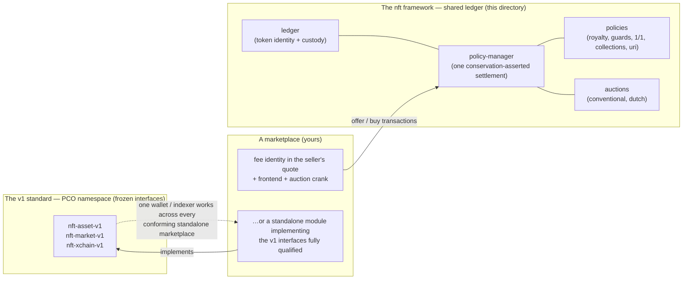

# The `nft` framework — a shared-ledger NFT standard, hardened

A complete NFT framework for Kadena (Pact 5.4ce / KDA-CE), authored by the PCO as a neutral
community standard in the `nft` namespace — **the catalog's NFT architecture**. It anchors token
identity in one shared ledger and builds the settlement/policy layer around five principles
produced by the PCO's security analysis of the previously deployed NFT stack (Marmalade V2), whose
settlement and policy layers that analysis found unsound. This is an original, independent
implementation: it shares no code with and does not depend on that stack, which this catalog does
not carry.

> **Launching your own market?** Start with the [marketplace quickstart](QUICKSTART.md) —
> what to deploy (usually: nothing), what to configure, and the whole onboarding journey in
> plain language.
>
> **Deep technical reference:** [TECHNICAL.md](TECHNICAL.md) — every mechanism down to the code:
> identity derivation, the policy system and its `-CALL` handshake, the conservation-asserted
> settlement worked to 12 dp, defpacts, auctions, cross-chain passports, the marketplace
> integration surface, the full capability inventory, and the test that proves each claim.

## The map — interfaces, framework, and your marketplace

Two independent tracks, both PCO-owned: a **standalone** marketplace custodies its own tokens and
implements the frozen v1 interfaces from the PCO namespace ([`contracts/standards/`](../standards/));
a **framework** marketplace holds no custody at all — it is a fee identity in seller-signed quotes,
settled by the shared ledger's policy-manager. The quickstart walks both.

## Identity: why a shared ledger

A token id is `n:{hash([token-details, chain-id, creation-guard])}` — derived from the creator's
guard. `create-token` re-derives the id, enforces the creation guard, and inserts exactly one row:

- **Forgery is impossible** — you cannot create a token whose id claims someone else's guard;
- **Double-mint is impossible** — one id, one row, forever;
- **The id is order-independent** — the ledger canonicalizes the policy list (name-sorted,
  duplicates rejected), so the same policy *set* always derives the same id.

Self-sovereign per-NFT modules cannot provide this anchor (anyone can deploy a lookalike module);
see the consignment spike under `contracts/standards/nft-consignment-spike/` for that
proving-ground record.

## Settlement: the five principles

1. **Fail closed.** Every required input (royalty spec, operation guards, collection id, quote) is
   typed and required — absence aborts; nothing defaults to permissive.
2. **One settlement, conservation-asserted.** Policies DECLARE payouts and move no money. The
   policy-manager pays every declared cut + the marketplace fee + the seller remainder from one
   capability-guarded per-sale escrow and asserts `escrow-in = Σ payouts` at the fungible's full
   precision. Same-payee legs merge; zero legs drop.
3. **Economics on-chain, never in the buy transaction.** The quote (price, fungible, seller payout
   account, fee) binds in STATE at offer, signed by the seller. The buyer supplies only their own
   paying account; a malicious economic payload in the buy transaction is ignored.
4. **Sale-only is explicit and robust.** Enforced at settlement by the royalty policy's opt-in
   flag — a sale through the pact always works and always pays the royalty; the property cannot be
   composed away and is never a blanket transfer ban.
5. **Minimal trusted surface.** Every policy hook is unreachable outside the ledger's lifecycle
   path: the manager `require-capability`s the registered ledger's matching `-CALL` capability
   through its stored modref before dispatching. Fabricated token-info dies at the gate.

## Layout

| Path | Contents |
|---|---|
| `interfaces/` | `token-policy` (the hook surface + payout schema + uri stance + the cross-chain passport hooks), `poly-fungible` (the multi-token accounting standard), `ledger-iface` (the `-CALL` handshake), `sale` (price-discovery sale contracts), `account-protocols` |
| `core/` | `ledger` (identity + balances + the offer/withdraw/buy sale defpact + policy-mediated `update-uri` + the `transfer-crosschain` defpact), `policy-manager` (dispatch, the single conservation-asserted settlement, the governance-registered sale-contract whitelist, the attachment-authoritative uri-update routing) |
| `policies/` | `royalty-policy`, `guard-policy`, `non-fungible-policy` (strict 1/1, minted once ever), `collection-policy`, `guarded-uri-policy` (guard-bound uri updates), `non-updatable-uri-policy` (unconditional uri veto) |
| `sale/` | `conventional-auction` (escrowed ascending bids, increment-enforced outbidding with full refunds, winner-only settlement, grace-windowed withdrawal), `dutch-auction` (interval-stepped declining curve) |
| `test/` | **14 suites**: `identity`, `settlement`, `negative-payout` (non-positive policy legs rejected), an adversarial suite per policy (`royalty-policy`, `guard-policy`, `non-fungible-policy`, `collection-policy`, `non-updatable-uri-policy`; `guarded-uri-policy` is exercised in `update-uri` and `xchain`), one per sale contract (`conventional-auction`, `dutch-auction`), `composition`, `update-uri` (incl. the veto composition case), `xchain` (the passport mechanics) and `marketplace-sim` (create on chain 0 -> sell on marketplace A -> relocate to chain 1 -> auction on marketplace B, all legs reconciled) |

## Price-discovery sales (auctions)

A quote may name a **governance-registered** sale contract instead of a fixed price (the quote then
carries the 0 discovery price). At settlement the buy transaction supplies only a CANDIDATE price;
the manager dispatches it to the sale contract, which must validate it against its own on-chain
state — the recorded winning bid, or the declining-price curve — before the manager binds it into
the quote and runs the same conservation-asserted settlement. Royalties and the marketplace fee are
carved from the discovered price: an auction is not a royalty bypass. A conventional auction's bid
escrow is per-sale and capability-guarded; every outbid refunds the previous bidder in full, and no
withdrawal path can strand a bid.

## Cross-chain relocation (the policy passport)

A token relocates between chains through the ledger's `transfer-crosschain` defpact. On the source
chain every attached policy validates the move and returns its **passport** — its own serialized
per-token state (the royalty spec, the operation guards, the 1/1 marker, collection membership, the
uri guard) — which yields to the target chain with the token's metadata. On the target chain (an
SPV-continued step, the only way to reach it) the token row is materialized on first arrival and
every policy re-binds its passport, so **the token's rules travel with it**: the creator's royalty
is enforced on every chain the token ever sells on. A sale-only token relocates owner-to-owner only
(a cross-chain ownership change would be a free transfer in two hops), and for a transfer-guarded
token (`guard-policy`) a relocation that changes the owner must satisfy the **transfer-guard** —
same-chain parity — while an owner relocating to themselves stays ungated. The id needs no re-derivation
on arrival and cannot be forged there: `create-token` re-derives with the LOCAL chain-id, so the
relocated id fails the protocol check for everyone, on every other chain, forever. The uri is
chain-local mutable state — a returning token keeps the local uri; all other passport state is
immutable and verified equal on return.

## URI updates (fail closed)

A token's uri is immutable unless some attached policy returns `"permit"` from the base
`token-policy` `uri-decision` hook AND none returns `"veto"`. The manager evaluates the stance of
**every attached policy** — there is no registry to be absent from — so `non-updatable-uri-policy`
(which always vetoes) makes the uri immutable no matter what else is stacked, and a permitting
policy additionally authorizes the specific update in its own body. A token with no uri-aware
policy is immutable by default.

## Relationship to the rest of the catalog

- **`contracts/standards/` (NFT interface standard v1)** — the compatibility standard for
  *standalone* marketplaces, each custodying its own tokens (the `fungible-v2` model). PCO owns
  the standard on-chain: the three interfaces are published once per network into the PCO
  principal namespace and marketplaces implement them fully qualified from there. This
  framework is the **shared-ledger track** that SPEC.md explicitly scopes out of v1: tokens live in
  one ledger, marketplaces are sale contracts, portability is native. The two coexist; conforming
  standalone marketplaces and this framework emit compatible economics by construction (state-bound
  quotes, conservation-asserted settlement, enforceable royalties).
- **`contracts/library/royalty-sale/`** — the standalone hardened marketplace template and v1
  reference implementation. This framework generalizes its settlement discipline (dust guard,
  merged legs, conservation assert) behind a policy architecture.

## Gates

Every change: all suites in `test/` green (`pact <name>.repl`) and the repository's static gate at
0 VIOLATIONs. Cross-chain classes remain DEVNET evidence: the repl carries yields across a simulated
chain switch (provenance-checked), but SPV verification and first-arrival row materialization on a
genuinely fresh chain are only provable against real chains — the devnet campaign runs the full
marketplace-hop scenario there.
