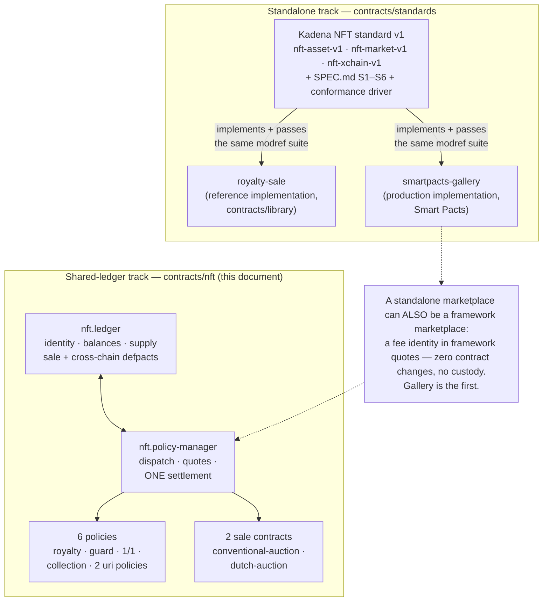
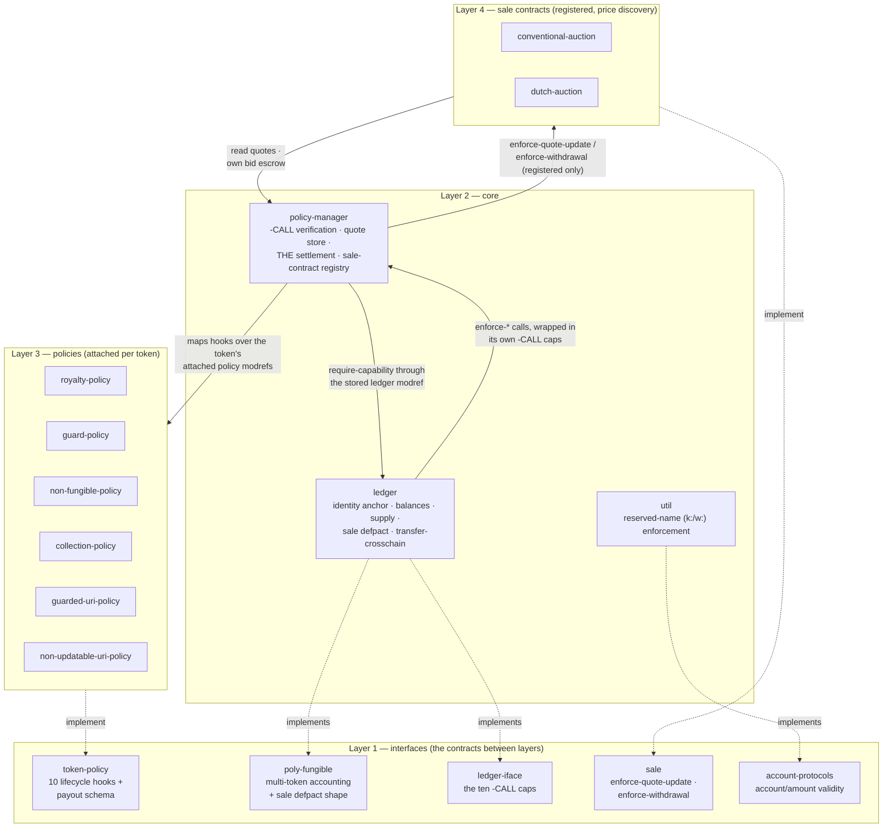
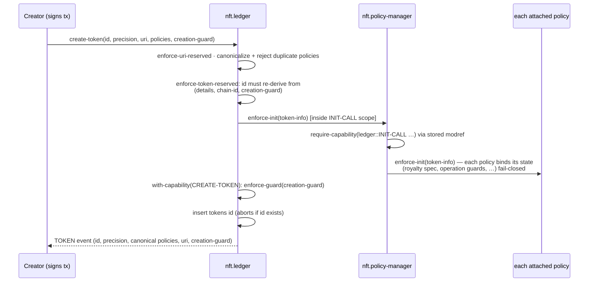
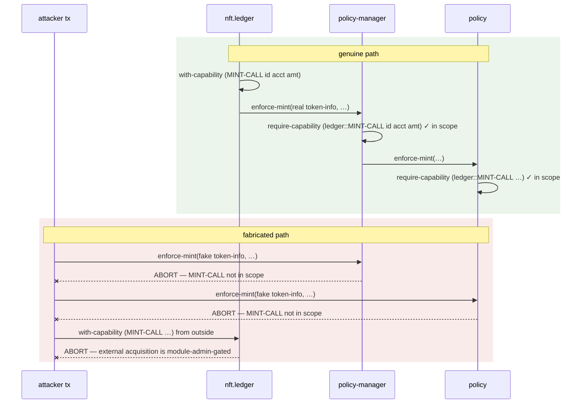
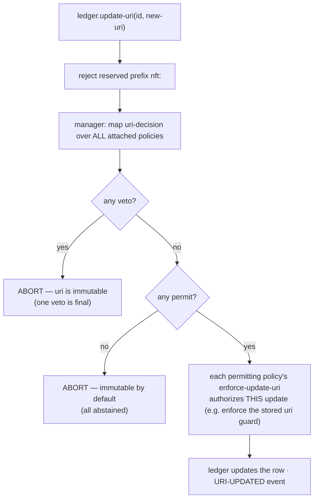
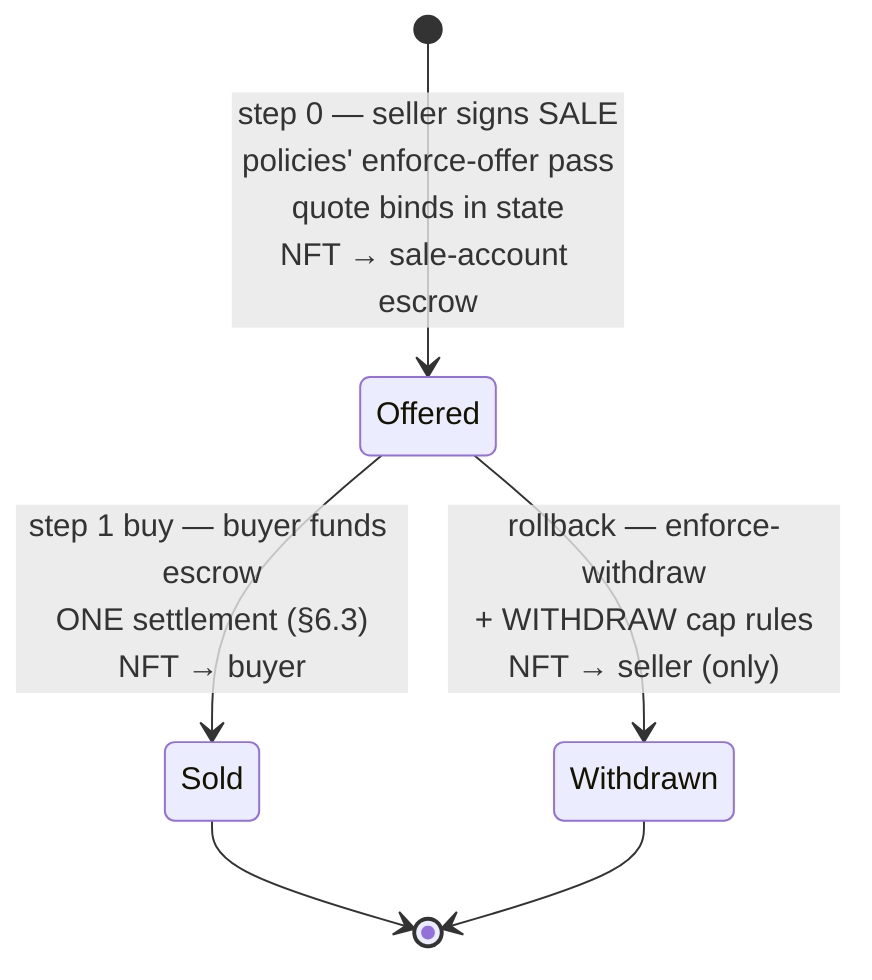
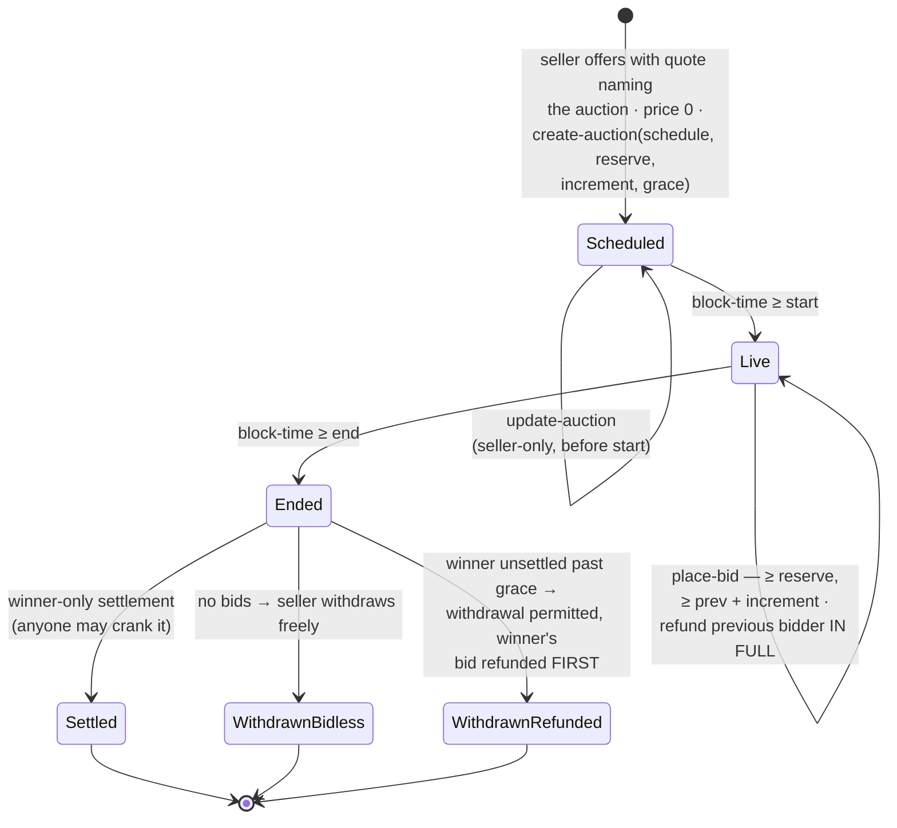
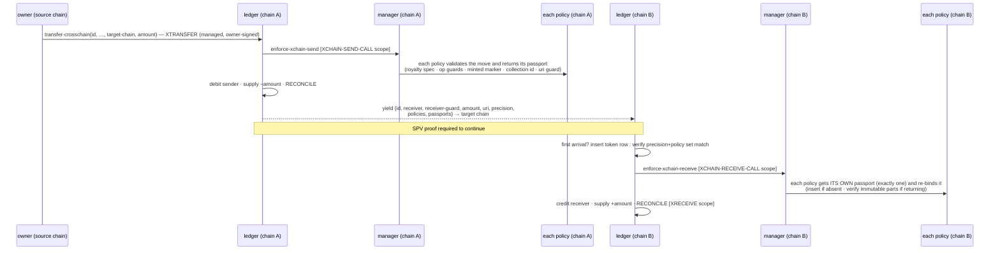
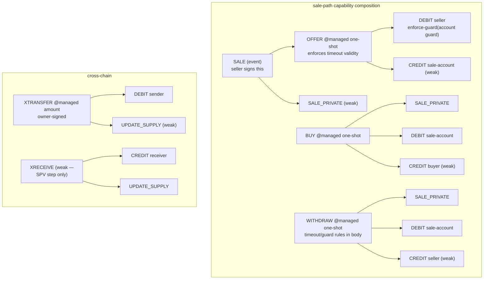

# The `nft` framework — technical reference

*`contracts/nft/` down to the mechanism · PCO pact-contract-catalog*

This is the deep technical reference for the catalog's NFT architecture: the
shared-ledger `nft` framework. The [README](README.md) is the orientation
document; this is its rigorous companion for engineers and technically literate
reviewers — protocol developers, marketplace builders, auditors, integrators.
Where the README says "one conservation-asserted settlement," this document shows
you the capability-guarded escrow principal, the two fungible interactions, and
the conservation assertion — with the code, the numbers, and the executable test
that proves each claim.

It assumes you know general blockchain concepts (transactions, signatures,
escrow, cross-chain bridging) but **not** Pact; every Pact mechanism is taught
where it first matters. Everything here is accurate to the code as written —
each mechanism cites the enforcing source and the test that proves it.

**Contents**

1. [The catalog's two NFT tracks](#1--the-catalogs-two-nft-tracks) — this framework, the interface standard, and exactly how they relate
2. [Pact in ten concepts](#2--pact-in-ten-concepts) — the language mechanisms everything else builds on
3. [Architecture and layering](#3--architecture-and-layering) — the 16 modules, who calls whom, where the trust boundaries are
4. [Token identity](#4--token-identity) — why forgery and double-mint are structurally impossible
5. [The policy system](#5--the-policy-system) — hooks, the `-CALL` handshake, the six policies, composition
6. [Settlement — the money](#6--settlement--the-money) — the escrow, the single payout routine, the conservation assert, worked to 12 decimal places
7. [The sale defpact](#7--the-sale-defpact) — offer → buy with withdraw rollback, and the timeout semantics
8. [Auctions](#8--auctions) — escrowed ascending bids and the declining curve; why price discovery can't be injected
9. [Cross-chain relocation](#9--cross-chain-relocation) — the policy passport
10. [Building a marketplace on this framework](#10--building-a-marketplace-on-this-framework) — the integration surface, field by field
11. [The capability model](#11--the-capability-model--why-its-safe) — every weak-body capability and why each is safe
12. [Guarantees and threat model](#12--guarantees-and-threat-model) — properties → mechanisms → tests, and the honest residuals
13. [Verify it yourself](#13--verify-it-yourself) — how to run every proof in this document

---

## 1 · The catalog's two NFT tracks

The catalog carries **two distinct-but-related NFT products**. They are not the
same thing, and conflating them produces wrong conclusions about custody,
portability, and trust. Both are original Pact 5 implementations built to the
same settlement discipline — state-bound economics, one conservation-asserted
settlement, enforceable royalties — which is what makes them economically
compatible by construction.

### This framework: the shared-ledger track

The `nft` framework (`contracts/nft/`, 16 modules) anchors the identity,
balances, and supply of every token in **one shared ledger**, and makes
everything else a pluggable extension:

- **policies** (royalty, operation guards, strict 1/1, collections, uri rules)
  are independent modules attached per token, consulted at every lifecycle event;
- **marketplaces are not custodians** — a marketplace is a *fee identity* bound
  into the seller's signed quote, plus optionally a registered *sale contract*
  (auction) that drives price discovery (§10);
- **portability is native** — a token relocates between chains through the
  ledger's own defpact, and its policy state travels with it (§9).

Its design derives from the PCO's security analysis of the previously deployed
NFT stack (Marmalade V2), whose settlement and policy layers that analysis found
unsound; the framework is an original, independent implementation of the five
principles that analysis produced (fail closed; one conservation-asserted
settlement; economics on-chain, never in the buy transaction; sale-only explicit
and robust; minimal trusted surface). Throughout this document the internal
finding names **ARCH-1**, **ARCH-2**, and **POL-1..3** refer to the specific
flaws each mechanism exists to fix — the framework sources carry the same names.

### The standalone track: the interface standard

[`contracts/standards/`](../standards/SPEC.md) is the **Kadena NFT interface
standard v1**: three deliberately un-upgradeable interfaces (`nft-asset-v1`,
`nft-market-v1`, `nft-xchain-v1`) plus normative clauses S1–S6 and a
modref-driven conformance suite. In that model each marketplace is its **own
module custodying its own tokens** — the `fungible-v2` model of compatibility:
every token contract is its own ledger, yet one wallet, one indexer, and one
aggregator work across all of them, because every implementation exposes the
same views, emits the same events, and obeys the same rules. Two independent
implementations pass the same conformance suite today:
[`royalty-sale`](../library/royalty-sale/README.md) (the MIT reference
implementation, in this catalog) and `smartpacts-gallery` (the production
implementation operated by Smart Pacts).

SPEC.md explicitly scopes shared-ledger portability *out* of v1. This framework
is that separate track.

### How they relate — precisely



Three statements capture the relationship exactly:

1. **Different custody models.** A framework token is a row in `nft.ledger`; a
   standalone token is a row in the module that minted it. A wallet talks to
   framework tokens through the ledger's poly-fungible surface, and to
   standalone tokens through the v1 interfaces. Neither system holds the
   other's tokens.

2. **A standalone marketplace can list framework tokens with zero contract
   changes.** In the shared-ledger model, "being a marketplace" means being the
   `fee-account`/`fee-guard`/`fee-bps` bound into the seller's signed quote at
   offer time (§6.2, §10). The framework's conservation-asserted settlement pays
   that fee identity like any other leg; the marketplace's own contract is never
   involved in the settlement and never custodies the token. Gallery operates
   this way as the framework's first marketplace, alongside its unchanged
   standalone catalog.

3. **Compatible economics by construction.** Both tracks bind all economic
   parameters into on-chain state *before* the buy (signed quote / listing
   snapshot), settle through one routine that asserts escrow conservation at the
   currency's full precision, and make royalties unbypassable (dust guards,
   sale-only rules, cross-chain restrictions). An indexer reading the two
   tracks' events sees the same economic invariants because both enforce them
   the same way — not because one defers to the other.

One number that deliberately differs and must not be averaged: the framework
caps any quote's marketplace fee at `MAX-FEE-BPS` = 1000 (**10%**, in
`policy-manager`); standalone implementations set their own policy (Gallery, for
instance, holds itself to an immutable 5% cap with a 2.5% default in its own
module). Both tracks cap creator royalties at 5000 bps (**50%**) — in this
framework that constant lives in `royalty-policy` (`MAX-ROYALTY-BPS`).

---

## 2 · Pact in ten concepts

Pact is Kadena's smart-contract language. It is deliberately non-Turing-complete
(no unbounded loops, no recursion), human-readable on chain, and built around an
explicit authorization system. These ten concepts carry the rest of this
document.

**1 — Modules and interfaces.** A *module* is a deployed unit of code with
tables and functions. An *interface* declares signatures a module can
`(implements …)`; Pact verifies every signature matches at load time. Interfaces
**cannot be upgraded** — ever (`CannotUpgradeInterface`) — which is why the
framework's extension points (`token-policy`, `sale`, `ledger-iface`) are
designed to be small and stable: a breaking change means a new interface, not an
edit.

**2 — Guards.** A *guard* is a first-class predicate value answering "may this
transaction act as this identity?". The commonest is a **keyset** (a set of
public keys + a predicate like `keys-all`); a transaction satisfies it by being
signed by those keys. `(enforce-guard g)` aborts the transaction if `g` is not
satisfied. Guards are stored in tables like any other value — an account row
carries the guard that authorizes spending from it.

**3 — Principals.** A *principal* is an account name cryptographically derived
from its guard: `k:<pubkey>` for single keys, `w:…` for multi-key keysets,
`c:…` for capability guards, `u:…` for user guards.
`(validate-principal g name)` re-derives the name from the guard and compares —
so a principal account name **cannot be squatted**: nobody can register
`k:alice…` with a guard other than alice's key. The framework requires principal
accounts at every trust boundary (`nft.util.enforce-reserved` for ledger
accounts; `validate-quote` for seller and fee payees; `royalty-policy` for the
creator; `conventional-auction` for bidders).

**4 — Capabilities.** A *capability* (`defcap`) is a named, parameterized
permission token with a body of checks. `(with-capability (CAP args) body…)`
runs the checks and, if they pass, puts `CAP args` **in scope** for `body`.
Crucially, **a capability can only be acquired from inside its defining module**
— for external code, acquisition is module-admin-gated, so an attacker's
transaction can never `with-capability` another module's cap. That single rule
is the foundation of most safety arguments in §11, and it is proven on a live
node, not just asserted (§13).

**5 — `require-capability` vs `enforce-guard`.** `(require-capability (CAP
args))` does *not* acquire anything; it **tests** that `CAP args` is already in
scope and aborts otherwise. A function that starts with `require-capability` is
therefore callable only from code paths that already passed the real checks — it
is how "private" helper functions are built. `enforce-guard` checks identity
(usually signatures); `require-capability` checks *provenance* — "am I inside
the genuine call path?".

**6 — Managed capabilities.** A cap declared `@managed` must be **installed** by
a transaction signer (or by `install-capability` in code) before it can be
acquired, and it carries one-shot or linear semantics. `coin.TRANSFER` is the
canonical example: a signer installs `TRANSFER sender receiver amount`,
authorizing at most `amount` to move — this is *scoped signing*: the signature
authorizes exactly one effect, not the whole module surface. A plain `@managed`
cap with no manager function is **one-shot**: acquirable exactly once per
install.

**7 — Capability guards and user guards.** `(create-capability-guard (CAP
args))` makes a *guard* that is satisfied only while `CAP args` is in scope —
combined with concept 4, only the defining module's own code paths can ever
satisfy it. `(create-capability-pact-guard …)` additionally pins the guard to
one running defpact instance. `(create-user-guard (f args))` makes a guard that
runs a function as its predicate. `(create-principal guard)` derives the
principal account name for any guard — so you can create an account **only
spendable by a specific code path**. That is what this document means by "a
capability-guarded escrow."

**8 — Defpacts.** A `defpact` is a multi-step transaction: each `step` executes
in its own transaction, in order, with `(yield data)` / `(resume …)` passing
state between steps — including **across chains**, where step *n+1* on the
target chain must present an SPV proof (a Merkle proof verified by the node)
that step *n* really happened on the source chain. `step-with-rollback` adds a
compensating action if the pact is cancelled at that step. `(pact-id)` is the
unique id of the running pact instance — the framework uses it as the sale id.
Cross-chain steps allow **no rollback**.

**9 — Tables, `insert`, and fail-closed reads.** `insert` writes a new row and
**aborts if the key exists** — used throughout as a once-ever gate. `update`
requires the row to exist; `write` upserts. `(read-msg "k")` reads a value from
the *transaction payload* — the data a caller sent. Reading economics from
`read-msg` inside a buy is the classic NFT-marketplace vulnerability; the
framework forbids it structurally (§6.2).

**10 — Events.** A `defcap` marked `@event` is emitted into the transaction log
when acquired (or explicitly via `emit-event`). Events are the indexer
vocabulary: the ledger's `TOKEN`/`RECONCILE`/`SUPPLY`/`TRANSFER`/`SALE`, the
manager's `QUOTE`/`SETTLED`, and each policy's binding events
(`ROYALTY`/`GUARDS`/`COLLECTION`/…) together let an indexer reconstruct every
token's full lifecycle and every sale's economics without reading state.

---
## 3 · Architecture and layering

### 3.1 Sixteen modules in four layers



| Module | Role | Key state |
|---|---|---|
| `interfaces/token-policy` | the policy hook surface: 10 hooks + the `payout` schema + the uri stance + the cross-chain passport hooks | — |
| `interfaces/poly-fungible` | the multi-token accounting standard the ledger implements | — |
| `interfaces/ledger-iface` | the ten `-CALL` capabilities securing the modref handshake | — |
| `interfaces/sale` | what a price-discovery sale contract implements | — |
| `interfaces/account-protocols` | account/amount validity + reserved-name protocols | — |
| `core/ledger` | identity, balances, supply; the sale defpact; `transfer-crosschain` | `tokens`, `ledger-table` |
| `core/policy-manager` | `-CALL` verification, quote store, **the** settlement, sale-contract registry | `quotes`, `ledgers`, `sale-contracts` |
| `core/util` | `enforce-reserved` and friends | — |
| `policies/royalty-policy` | enforceable creator royalties + explicit sale-only | `royalties` |
| `policies/guard-policy` | four required per-operation guards | `op-guards` |
| `policies/non-fungible-policy` | strict 1/1: precision 0, minted once ever, burned whole | `minted-table` |
| `policies/collection-policy` | operator-curated, size-capped collections | `collections`, `collection-tokens` |
| `policies/guarded-uri-policy` | guard-authorized uri updates | `uri-guards` |
| `policies/non-updatable-uri-policy` | the unconditional uri veto | — |
| `sale/conventional-auction` | escrowed ascending bids, winner-only settlement | `auctions` + per-sale bid escrow |
| `sale/dutch-auction` | interval-stepped declining price curve | `auctions` |

The division of labor is strict:

- **`ledger`** is the only module that touches token balances and supply. It
  owns token identity (§4), the per-`(token, account)` balance table, the sale
  defpact (§7), and the cross-chain defpact (§9). Every lifecycle mutation —
  create, mint, burn, transfer, offer, withdraw, buy, uri update, cross-chain
  send and receive — calls the manager's matching `enforce-*` hook *before*
  moving anything.
- **`policy-manager`** is the dispatcher and the *only* module that moves sale
  money. It verifies each call really came from the registered ledger (the
  `-CALL` handshake, §5.2), maps the hook over the token's attached policies,
  stores the sale **quote** at offer, and runs the single conservation-asserted
  settlement at buy (§6). It also holds the governance-registered sale-contract
  whitelist (§8).
- **Policies** are per-token extension modules. They validate lifecycle events
  and *declare* sale payouts — they never move money and never hold escrow
  authority.
- **Sale contracts** implement price discovery (auctions). They validate the
  final price against their **own on-chain state** and manage their own bid
  escrow; they cannot write manager state.

### 3.2 Trust boundaries

The ledger trusts the manager it was compiled against (direct module reference);
the manager trusts only the *registered* ledger modref (bound once,
governance-gated `init`) and *registered* sale contracts. Policies and sale
contracts are mutually untrusting — a hostile policy cannot skim the escrow
(§6.3), and a sale contract's hooks are unreachable outside the manager's
settlement path (§8).

The one necessary exposure is the quote's fungible: settlement must execute the
quoted `fungible-v2` module's `transfer-create` while the per-sale escrow
capability is in scope (the seller chose that fungible by signing the quote).
The manager's own header states the containment argument, and it is worth
restating precisely: that capability is scoped to **this one sale-id** — its
escrow principal is sale-unique and holds only this sale's funds — and the
conservation assert closes the ledger over exactly the quoted price, so a
hostile fungible can only misbehave inside a sale its own participants opted
into. Policy hooks run *before* the escrow capability is acquired, never inside
it.

---

## 4 · Token identity

A framework token id is not chosen — it is **derived**:

```
id = "n:" + hash([ {uri, precision, canonical-policies}, chain-id, creation-guard ])
```

The implementation ([core/ledger.pact](core/ledger.pact)):

```pact
(defun create-token-id:string (details:object{token-details} creation-guard:guard)
  (let ((canon:object{token-details}
          { 'uri: (at 'uri details), 'precision: (at 'precision details)
          , 'policies: (canonical-policies (at 'policies details)) }))
    (format "{}:{}" [TOKEN-ID-PREFIX
      (hash [(format "{}" [canon]) (at 'chain-id (chain-data)) creation-guard])])))
```

`create-token` then enforces three things, in order:

1. **Re-derivation** (`enforce-token-reserved`): the submitted id must equal
   `create-token-id(details, creation-guard)` recomputed on the spot. A
   fabricated id — any id not derived from these exact details, this chain, and
   this guard — fails here. An id with an unrecognized reserved prefix (anything
   of the shape `X:…` other than `n:…`) is rejected outright: the
   **reserved-prefix protocol** keeps the `n:` namespace un-squattable, the same
   way `k:` account names work.
2. **Guard control** (the `CREATE-TOKEN` capability body is
   `(enforce-guard creation-guard)`): the caller must *satisfy* the creation
   guard the id hashes over. You cannot create a token whose id embeds someone
   else's guard — their key would have to sign your transaction.
3. **Insert-once**: the row is written with `insert`, which aborts on a
   duplicate key. One id, one row, forever.

Together: **forgery is impossible** (steps 1+2 — the id is bound to a guard only
its owner can wield) and **double-mint is impossible** (step 3). This anchor is
what a self-sovereign per-NFT module can never provide — anyone can deploy a
lookalike module, but nobody can produce a second row for the same `n:…` id in
*the* ledger. Proof: [test/identity.repl](test/identity.repl) (29 assertions —
fabricated ids, correctly derived ids for someone else's guard, duplicate
creation, plus the accounting protocol).

**Policy-list canonicalization — the id is order-independent.** Pact's plain
`sort` is a no-op on module references, so the ledger sorts a *decorated* list:

```pact
(defun canonical-policies:[module{token-policy}] (policies:[module{token-policy}])
  (map (lambda (o) (at 'p o))
    (sort ['k]
      (map (lambda (p:module{token-policy}) { 'k: (format "{}" [p]), 'p: p })
           policies))))
```

Each policy is wrapped in `{'k: "<fully-qualified-name>", 'p: <modref>}`, sorted
by `'k`, and unwrapped. The id derivation, the stored row, the `TOKEN` event,
and every subsequent hook dispatch all use this canonical order, and duplicate
policy names are rejected (`distinct` length check in `create-token`).
Consequence: the same policy **set** always derives the same token id no matter
what order the creator passed — there is no "same token, different id because
the list was shuffled" ambiguity. Proof:
[test/redteam/B1-identity-sort.repl](test/redteam/B1-identity-sort.repl).

Because `chain-id` is a hash input, the same details and guard derive a
**different id on every chain** — which is exactly what makes cross-chain
arrival safe (§9): a relocated token's id can never be re-created or
collided-with by `create-token` on the target chain, because re-derivation there
uses the local chain id.

The uri side has its own reserved prefix: no caller may set or update a uri
starting with `nft:` (`URI-RESERVED-PREFIX`, enforced at create and at
`update-uri`) — a protected namespace for future protocol-level metadata.



---

## 5 · The policy system

### 5.1 The hook surface

[`token-policy`](interfaces/token-policy.pact) declares ten hooks. Attaching a
policy to a token means: **every one of these will be called on that policy at
the matching lifecycle event, and every attached policy must pass**.

| Hook | Fires at | A hardened policy uses it to… |
|---|---|---|
| `enforce-init` | `create-token` | bind its economic/authorization state from **required** payload inputs — fail closed |
| `enforce-mint` | `mint` | gate issuance (mint guard, 1/1 shape, collection operator) |
| `enforce-burn` | `burn` | gate destruction (burn guard, whole-token rule) |
| `enforce-offer` | sale defpact step 0 | gate listing (sale guard) and reject dust prices |
| `enforce-withdraw` | sale defpact rollback | (deliberately permissive — see §5.3, guard-policy) |
| `enforce-buy` | sale defpact step 1 | authorize the sale and **return the payouts it declares** (`[object{payout}]`) |
| `enforce-transfer` | free transfer | reject if sale-only; enforce the transfer guard |
| `uri-decision` / `enforce-update-uri` | `update-uri` | vote `"veto"` / `"permit"` / `"abstain"`, then authorize the specific update |
| `enforce-xchain-send` / `enforce-xchain-receive` | cross-chain defpact | validate the move and serialize/re-bind its **passport** (§9) |

The `payout` schema is the heart of the money model:

```pact
(defschema payout
  account:string
  guard:guard
  amount:decimal)
```

A policy *declares* a cut — computed from **its own on-chain state**, never from
the buy transaction — and moves no money. The manager pays every declared payout
plus the marketplace fee plus the seller remainder from one escrow and asserts
conservation (§6.3). No policy hook ever holds spend authority over the escrow —
that is the ARCH-1 fix as an architectural rule.

### 5.2 The `-CALL` handshake — why fabricated calls die at the gate

The hooks are public functions on public modules. What stops an attacker from
calling `policy-manager.enforce-mint` directly with a fabricated `token-info`
(say, `supply: 0.0` to satisfy a 1/1 policy), or calling a policy's hook
straight?

The **`-CALL` capability handshake**. The ledger implements
[`ledger-iface`](interfaces/ledger-iface.pact) — ten weak-body capabilities
(`INIT-CALL`, `MINT-CALL`, `BUY-CALL`, …). Around every manager call, the ledger
acquires the matching one:

```pact
;; ledger.pact — the genuine lifecycle path
(defun mint:bool (id:string account:string guard:guard amount:decimal)
  (with-capability (MINT-CALL id account amount)
    (policy-manager.enforce-mint (get-token-info id) account guard amount))
  …)
```

And the manager — plus **every policy, independently** — verifies it mid-call,
through the *registered* ledger modref:

```pact
;; policy-manager.pact — the gate
(defun enforce-mint:bool (token:object{token-info} account:string guard:guard amount:decimal)
  (let ((l:module{ledger-iface} (retrieve-ledger)))
    (require-capability (l::MINT-CALL (at 'id token) account amount)))
  (map (lambda (p:module{token-policy}) (p::enforce-mint token account guard amount))
       (at 'policies token))
  true)
```

Recall the two Pact rules this leans on (§2, concepts 4–5): a capability can be
acquired **only from inside its defining module** (external acquisition is
module-admin-gated), and `require-capability` is a scope *test*, not an
acquisition. So `MINT-CALL id account amount` can be in scope only if
`nft.ledger` itself — the one module registered in the manager's `ledgers` table
at governance-gated init — put it there, from inside its real `mint`, with these
exact arguments. A direct call to the manager's hook finds no such cap in scope
and aborts. A direct call to a policy's hook hits the same check the policy
itself repeats. And the arguments are part of the capability, so even a genuine
in-flight mint can't be repurposed to smuggle a *different* token/account/amount
through the gate. Proof: every suite carries `-CALL` gate assertions;
[test/redteam/C1-weakcap-freemint.repl](test/redteam/C1-weakcap-freemint.repl)
is the dedicated attack run (direct acquisition of every weak cap + direct calls
to every internal money mover), and the same class is re-proven against a live
node by the red-team devnet probes (§13).



### 5.3 The six policies, mechanism by mechanism

**`royalty-policy`** — enforceable creator royalties.
*Init (fail closed):* the create-token transaction **must** carry a
`royalty_spec` payload object `{creator, creator-guard, bps, sale-only}`; the
typed `read-msg` aborts on a missing or partial spec (the POL-1 fix). `bps` is
capped at `MAX-ROYALTY-BPS` = 5000 (50% — a higher rate could leave the seller
nothing) and the creator must be the principal of `creator-guard`
(impersonation rejected). The spec is inserted into the policy's own
`royalties` table — immutable thereafter (no update path) — and the `ROYALTY`
event is emitted.
*Settlement (declare, don't move):* `enforce-buy` computes
`floor(quote-price × bps / 10000)` at the quote fungible's precision — the price
read from the manager's state-bound quote, never a payload — and returns it as a
single payout to the stored creator:

```pact
(defun royalty-cut:decimal (sale-id:string bps:integer)
  (let* ((q (policy-manager.get-quote sale-id))
         (fungible:module{fungible-v2} (at 'fungible q))
         (prec:integer (fungible::precision)))
    (floor (/ (* (at 'price q) (dec bps)) (dec BPS-DENOM)) prec)))
```

*Dust guard (both ends):* at offer, a fixed price whose floored royalty is zero
is rejected — otherwise a near-zero price would be a royalty-free ownership
change through `buy`. A quoted sale's price is 0 at offer (discovered later), so
the same check re-fires in `enforce-buy` against the finalized price.
*Sale-only (the POL-2 fix):* an explicit opt-in flag. `enforce-transfer` rejects
free transfers of a sale-only token; a sale through the sale defpact always
works and always pays — the property can't be composed away by stacking another
policy (every policy must pass) and is never a blanket transfer ban.
Cross-chain, a sale-only token may relocate only owner-to-owner (§9).
*Honest limits, stated in the source:* the royalty is denominated in the quote's
fungible (the seller picks the currency per listing), and no on-chain rule can
stop economically-equivalent evasion such as an under-priced quote settled
off-chain. The guarantees are: the rate binds at create, the cut is computed
from state, and every on-pact sale pays it. Proof:
[test/royalty-policy.repl](test/royalty-policy.repl) (26 assertions, including a
secondary sale where creator ≠ seller).

**`guard-policy`** — four per-operation guards, all required.
Init reads `operation_guards` = `{mint-guard, burn-guard, sale-guard,
transfer-guard}` — a typed read of the whole object, so a **missing field aborts
creation** rather than defaulting to "anyone can, forever" (POL-1 again: the
fail-closed rule exists because the analyzed stack's guard policy defaulted
absent guards to an always-true guard). Then: mint enforces `mint-guard`; burn
enforces `burn-guard` *in addition to* the ledger's own owner check; offer
(listing) enforces `sale-guard`; free transfer enforces `transfer-guard`, and a
cross-chain relocation that *changes* the owner enforces it too (same-chain
parity — §9). Two deliberate asymmetries: **buy is not gated** — a buyer cannot
carry the seller-side guard, so gating buy would make every listed token
unsellable; and **withdraw is not gated** — the ledger's `WITHDRAW` cap already
authenticates the seller, and adding the sale-guard there would let the guard
holder hold the seller's escrowed token hostage. Proof:
[test/guard-policy.repl](test/guard-policy.repl) (19 assertions, four distinct
keys proving no cross-satisfaction).

**`non-fungible-policy`** — the strict 1/1 shape.
Init requires `precision 0`; mint requires `amount = 1.0` **and** `supply = 0`
**and** inserts a row into `minted-table` — the insert is a **once-ever gate**:
after a burn returns supply to 0, re-minting still collides with the marker row
and aborts. Burn and offer must take the whole token (`amount = 1.0`). Supply is
therefore always exactly 0 or 1. Proof:
[test/non-fungible-policy.repl](test/non-fungible-policy.repl) (18 assertions,
including burn-then-remint).

**`collection-policy`** — operator-curated, size-capped collections.
Collections are self-serve (`create-collection` proves the operator guard). A
token joins at create-token via the **required** `collection_id` payload —
unknown or missing collection aborts — and only with the operator's signature
(`OPERATOR` capability), while `size < max-size` (0 = unbounded). Minting a
collection token is likewise operator-authorized: curation covers both admission
and issuance. Proof: [test/collection-policy.repl](test/collection-policy.repl)
(22 assertions).

**`guarded-uri-policy`** — guard-authorized metadata updates.
Init requires a `uri_guard` payload (fail closed); the stored guard then
authorizes each specific update through `enforce-update-uri`. It votes
`"permit"` in the stance protocol below.

**`non-updatable-uri-policy`** — the immutability marker.
Votes `"veto"` unconditionally; its `enforce-update-uri` is `(enforce false …)`.
Attaching it makes the uri immutable *no matter what else is stacked*.

### 5.4 Composition: every policy must pass; one veto is final

Lifecycle hooks compose by conjunction — the manager `map`s the hook over the
canonical policy list and Pact's abort semantics make any single failure fatal
to the whole transaction. Payout declarations compose by concatenation: the
manager folds every policy's `enforce-buy` result into one list and settles it
as a whole (§6.3). [test/composition.repl](test/composition.repl) (24
assertions) runs one token carrying `royalty-policy + guard-policy +
non-fungible-policy` and proves every rule holds simultaneously — creation
demands *every* policy's required input, mint needs the mint-guard *and* the 1/1
shape, settlement reconciles the full split with a malicious buyer payload
ignored.

Uri updates use an explicit stance protocol on the **base** interface —
`uri-decision` returns `"veto"`, `"permit"`, or `"abstain"` — and the manager
evaluates it over **every attached policy**:



Because the stance lives on the base interface, the routing is
**attachment-authoritative**: there is no out-of-band registry a policy could be
absent from, which is precisely the bypass an optional registry design would
reintroduce — an attached-but-unregistered veto would be silently skipped. A
token with no uri-aware policy is immutable by default (all abstain → no permit
→ reject). Proof: [test/update-uri.repl](test/update-uri.repl) (13 assertions),
including the audit-hardened veto-composition case: stacking the veto policy
over a permitting policy makes the veto final *purely by attachment*, and the
permitter's own guard signature does not rescue the update.

---
## 6 · Settlement — the money

This is the centerpiece. Everything else exists so that this one routine can be
trusted.

### 6.1 Two escrows, both principals no human can spend

The framework implements "escrow" as **principal accounts whose guards are
satisfiable only by a specific code path** (§2, concept 7). There are two per
sale, holding different assets:

| Escrow | Holds | Guard construction | Satisfiable only… |
|---|---|---|---|
| The manager's **fungible escrow** (one per sale-id) | the sale price during settlement | `create-capability-guard (ESCROW sale-id)` | while the manager's `ESCROW sale-id` cap is in scope — acquired only inside its settlement routine |
| The ledger's **NFT escrow** (`sale-account`, per sale) | the *token* between offer and buy | `create-capability-pact-guard (SALE_PRIVATE (pact-id))` | inside the very defpact instance that created it (a *pact guard* additionally pins the pact-id) |

```pact
;; policy-manager.pact — the fungible escrow
(defcap ESCROW:bool (sale-id:string) true)
(defun escrow-guard:guard (sale-id:string) (create-capability-guard (ESCROW sale-id)))
(defun escrow-account:string (sale-id:string) (create-principal (escrow-guard sale-id)))

;; ledger.pact — the NFT escrow
(defun sale-account:string ()
  (create-principal (create-capability-pact-guard (SALE_PRIVATE (pact-id)))))
```

Note what is *not* here: no keyset, no admin key, no override. `ESCROW` and
`SALE_PRIVATE` have weak (trivially-true) bodies — their entire security is that
capabilities acquire only inside their defining module (§11 examines every such
cap). Governance cannot spend either escrow: the framework's `GOVERNANCE` caps
gate upgrades and the registries, and no admin path acquires `ESCROW` or
`SALE_PRIVATE`.

The escrow principal names are **deterministic and public** — the sale-id is
`(pact-id)`, and anyone can compute the `c:…` escrow principal from it before
the sale settles. That predictability is safe here: knowing the name grants
nothing (the guard still requires the capability in scope), the conservation
check is baseline-relative so donated funds can't break settlement (§6.3), and
the manager deliberately does **not** pre-create the escrow account at offer — a
mempool watcher could otherwise front-run the visible offer with a duplicate
`create-account` and abort the seller's transaction. The buy step's
`transfer-create` creates the account or enforces the guard of a pre-existing
one; same fail-closed guarantee, no griefing surface.

### 6.2 Economics bind in state, before the buy — the ARCH-2 fix

The rule: *no parameter that affects the money moved may be read from the
transaction that triggers the payment.* The analyzed stack read the marketplace
fee percentage and payee straight from the buyer's payload — any buyer could set
the fee to zero. Here, the seller's offer transaction carries a `quote` payload,
validated and **stored** at offer time:

```pact
(defschema quote-spec
  fungible:module{fungible-v2}
  price:decimal
  seller-account:string
  seller-guard:guard
  fee-account:string
  fee-guard:guard
  fee-bps:integer
  sale-contract:string)
```

`validate-quote` enforces: price > 0 for a fixed-price sale (or exactly 0 for a
quoted sale naming a registered, enabled sale contract — §8); price meets the
fungible's precision; `fee-bps ∈ [0, 1000]` (`MAX-FEE-BPS`, the 10% cap); seller
and — whenever a fee is charged — fee payee are principal accounts validated
against their guards. The `QUOTE` event publishes the binding. Reading the
payload here is safe *because it is the seller's transaction*: the seller signs
the economics they are agreeing to.

At buy, the *only* things read from the buyer's transaction are the buyer's own
paying account (`buyer_fungible_account`), the buyer identity for the ledger
step (`buyer`/`buyer-guard`), and — for auctions — a candidate price that the
sale contract must validate against its own recorded state (§8). A malicious buy
payload stuffed with fee/royalty/price/payee overrides is simply never read.
Proof: [test/settlement.repl](test/settlement.repl) drives `buy` with exactly
such a payload and asserts the state-derived split.

Quote rows are **permanent**: a settled or withdrawn sale keeps its row (Pact
has no row deletion; the one-shot defpact steps make replay impossible), so the
`quotes` table doubles as the immutable sale-economics history.

### 6.3 One settlement, one conservation assert — the ARCH-1 fix

The rule: *exactly one routine moves sale money, and it proves conservation
instead of assuming it.* The analyzed stack defined "conserved" as *whatever
survives the policy loop* — every stacked policy shared spend authority over the
escrow, so one hostile policy could skim and the seller silently absorbed the
shortfall. Here, policies declare; the manager pays.

```mermaid
sequenceDiagram
    participant B as buyer (continues the sale defpact)
    participant L as nft.ledger (sale step 1)
    participant M as policy-manager.enforce-buy
    participant P as each attached policy
    participant F as quote fungible
    B->>L: continue sale (buyer, buyer-guard, buyer_fungible_account)
    L->>M: enforce-buy(token-info, …)  [inside BUY-CALL scope]
    M->>M: require-capability (ledger::BUY-CALL …) ✓
    M->>M: read the quote row — price, fee identity, seller payout (state, not payload)
    M->>F: INTERACTION 1 [FUNDING-CALL scope]:<br/>transfer-create buyer-account → escrow (exactly price)
    M->>M: funded := balance(escrow)
    M->>P: enforce-buy — each policy DECLARES its payouts<br/>(computed from its own state; moves nothing)
    M->>M: reject non-positive legs · fee := floor(price×bps/10000) ·<br/>proceeds := price − cuts − fee (≥ 0) · MERGE same-payee legs
    rect rgb(235,245,235)
    note over M,F: with-capability (ESCROW sale-id)
    M->>F: INTERACTION 2: pay each merged leg<br/>(install TRANSFER + transfer-create)
    end
    M->>M: ASSERT balance(escrow) = funded − price
    M-->>B: SETTLED(sale-id, price, fee, proceeds)
    L->>L: move the escrowed NFT to the buyer [BUY cap]
```

The settlement (`policy-manager.enforce-buy`), in exact order:

1. **Gate**: `require-capability (l::BUY-CALL …)` — the handshake (§5.2).
2. **Price finalization**: fixed-price sales use the stored quote price; quoted
   sales validate the buyer's candidate against the sale contract's own state
   and bind it into the quote (§8).
3. **Interaction 1 — fund the escrow**: `fungible::transfer-create buyer-account
   escrow price` inside `FUNDING-CALL` scope (which lets an auction's bid escrow
   pay instead of a wallet — §8.1). The funded balance is then read: `funded`.
4. **Policies declare**: every attached policy's `enforce-buy` returns its
   payouts; the manager folds them into one list. Every declared leg must be
   **strictly positive** — a zero leg is noise, and a *negative* leg would
   shrink the cut total (inflating the seller remainder) while the merge step
   drops it from the paid set, letting the two accountings disagree. Fail
   closed. Proof: [test/negative-payout.repl](test/negative-payout.repl),
   driven by a hostile fixture policy that declares a negative cut.
5. **Fee and remainder**: `fee = floor(price × fee-bps / 10000, precision)`;
   `proceeds = price − (cuts + fee)`; `enforce (proceeds ≥ 0)`.
6. **Merge**: same-payee legs coalesce into one (below).
7. **Interaction 2 — pay every leg** from the escrow, inside `ESCROW sale-id`
   scope, each via `install-capability (fungible::TRANSFER …)` +
   `transfer-create`.
8. **The conservation assert**:

```pact
(let ((final (fungible::get-balance escrow)))
  (enforce (= final (- funded price)) "escrow not fully settled — conservation failed"))
```

Note the form: **return-to-baseline, not return-to-zero**. `funded` was measured
*after* interaction 1, so the assert says "exactly `price` left this escrow
during settlement." If some third party had donated dust to the (publicly
computable) escrow address beforehand, a `= 0` check would brick every future
settlement of that sale; the baseline-relative check is immune. Proof:
[test/redteam/A1-conservation.repl](test/redteam/A1-conservation.repl).

The merge step exists because of a Pact mechanism: `fungible-v2.TRANSFER` is a
**managed** capability, and installing the same `(escrow, payee, …)` capability
twice in one transaction collides. If the creator *is* the seller (a primary
sale), or the creator happens to be the fee account, naive per-leg payment would
install two `TRANSFER escrow payee` caps and abort — an accidental
denial-of-service on exactly the most common sale shape. So the manager folds
payouts through `merge-payout`, which sums amounts for an already-seen payee and
drops zero legs:

```pact
(defun merge-payout:[object] (acc:[object] p:object)
  (if (<= (at 'amount p) 0.0)
    acc
    (let ((seen (contains (at 'account p) (map (at 'account) acc))))
      (if seen
        (map (lambda (x:object)
               (if (= (at 'account x) (at 'account p))
                 (+ { 'amount: (+ (at 'amount x) (at 'amount p)) } x)
                 x))
             acc)
        (+ acc [p])))))
```

One payee, one leg, one install — collisions are structurally impossible within
a settlement.

### 6.4 Worked examples, reconciled to 12 decimal places

KDA (`coin`) has precision 12; every amount below is exact at 12 dp. All three
examples are executed, not hypothetical — the first and third are
[test/marketplace-sim.repl](test/marketplace-sim.repl) (19 assertions) and the
devnet campaign (§13).

**Example 1 — a fixed-price sale with a merged leg.** Token with a 1000 bps
royalty (creator: alice), listed by alice (a primary sale — creator *is*
seller) at 100 KDA under a marketplace fee identity of 250 bps:

| Leg | Formula | Amount | Payee |
|---|---|---|---|
| royalty | `floor(100 × 1000/10000, 12)` | 10.0 | alice (creator) |
| fee | `floor(100 × 250/10000, 12)` | 2.5 | the marketplace's fee account |
| proceeds | `100 − 10.0 − 2.5` | 87.5 | alice (seller) |

Alice appears twice, so the merge folds her legs into **one 97.5 transfer** (one
`TRANSFER` install — the payee-collision case §6.3 exists for). Escrow in = 100;
Σ out = 100; assert `final = funded − 100` ✓.

**Example 2 — flooring at full precision.** A 500 bps royalty and a 250 bps
fee on a price of 99.999999999999 KDA (12 dp):

| Leg | Raw product | Floored at 12 dp |
|---|---|---|
| royalty (5%) | 4.99999999999995 | **4.999999999999** |
| fee (2.5%) | 2.499999999999975 | **2.499999999999** |
| proceeds | — | **92.500000000001** |

The percentage legs are *floored* — never rounded up — and the remainder formula
`price − cuts − fee` hands the flooring dust to the seller, so the legs sum to
exactly the price by construction and the conservation assert holds with no
sub-precision residue anywhere. This is also why the dust guard is needed: floor
is the honest choice for the payer, but at absurdly low prices it floors a real
royalty to zero — so such prices are refused instead.

**Example 3 — two marketplaces, two chains, one royalty stream.** The full
`marketplace-sim.repl` story; the token carries `royalty-policy (1000 bps,
alice) + guard-policy + non-fungible-policy`.

*Sale 1 — chain 0, marketplace A's fee identity (250 bps), fixed price 100,
seller = alice:* exactly example 1 — alice nets 97.5 in one merged leg,
marketplace A earns 2.5.

*Sale 2 — after a cross-chain relocation to chain 1 (§9), an ascending auction
under marketplace B's fee identity (500 bps), won at 200:*

- royalty: **20.0** → alice (the passport carried her terms to chain 1)
- fee: **10.0** → marketplace B
- proceeds: **170.0** → bob (the seller on chain 1)

Final balances reconcile globally: alice 97.5 + 20 = **117.5**; bob paid 100,
earned 170 → **1070**; carol paid her 200 winning bid → **800**; marketplace A
**2.5**; marketplace B **10**. Sum = 2000.0 = exactly the two buyers' funding —
global coin conservation across two sales, two marketplaces, two chains,
asserted in the suite's final transaction, and replayed against real chains by
the devnet campaign.

---

## 7 · The sale defpact

A sale is the ledger's `sale` defpact (declared in
[`poly-fungible`](interfaces/poly-fungible.pact)):



**Step 0 (offer)** runs the policies' `enforce-offer` (sale guard, dust guard),
stores the quote (§6.2), then escrows the NFT itself into the per-pact
`sale-account` — the `create-capability-pact-guard (SALE_PRIVATE (pact-id))`
principal from §6.1. The seller's signature installs the one-shot `OFFER`
managed cap, scoped to exactly this token/amount/timeout.

**Step 1 (buy)** takes `buyer`/`buyer-guard` from the continuation payload, runs
the manager's settlement (§6.3), then moves the escrowed NFT to the buyer under
the one-shot `BUY` cap.

**Rollback (withdraw)** is step 0's compensating action — the *only* way an
offered NFT leaves escrow other than a buy, and it can only return the token to
the seller (`credit-account` uses the seller's stored guard). A quoted sale's
contract must also consent (§8.2).

**Timeout semantics** (unix seconds; they gate *withdrawal*, not buying):

| `timeout` | Who can withdraw, when | Buyable until |
|---|---|---|
| `0` | the seller, any time (their account guard is enforced) | withdrawn |
| `t > 0` | **nobody** until `t` (the offer is withdraw-locked); after `t`, *anyone* may trigger the rollback — the token can only go back to the seller | withdrawn — an un-withdrawn offer remains buyable even after `t` |

So `t > 0` is a seller commitment device ("this price stands until `t`"), and
the post-`t` anyone-can-trigger rule means an abandoned offer can always be
cleaned up without stranding the NFT — but never redirected. For auctions, this
clock is deliberately separate from the auction's own schedule; set timeout 0
(or ≥ the auction's end) and let the sale contract's consent hook govern (§8.2).

**Sale-id determinism.** The sale-id *is* `(pact-id)` — deterministic given the
transaction — and the fungible escrow principal derives from it, so a buyer's
wallet can compute the escrow account and pre-authorize its `TRANSFER` before
the buy executes (the test suites do exactly this with a pinned `env-hash`).
Predictability is safe for the reasons in §6.1.

**One-shot managed caps and scoped signing.** `OFFER`, `WITHDRAW`, and `BUY` are
plain `@managed` — installable once, acquirable once. A seller signing an offer
scopes their signature to `SALE …` (which composes `OFFER` + the escrow's
`SALE_PRIVATE`); they are not granting module-wide authority, and a captured
signature cannot be replayed into a second offer.

---

## 8 · Auctions

Fixed prices need no price discovery; auctions do. The framework's rule for
price discovery (principle 3 of its settlement discipline): **the final price
must be bounded by the sale contract's own recorded on-chain state — never a raw
payload value.**

### 8.1 The registered-contract gate

A quote may name a sale contract instead of a price (then `price` must be 0 —
"discovered, never pre-set"). Only **governance-registered** contracts
participate: `register-sale-contract` keys the registry by the contract's own
fully-qualified name derived from the modref — so a name cannot be claimed for
foreign code — and `insert` makes registration one-time. A kill-switch
(`set-sale-contract-enabled`) blocks *new* offers and settlements through a
disabled contract, but withdrawal still consults it — the escape hatch never
closes. The two hooks a sale contract implements
([`sale`](interfaces/sale.pact): `enforce-quote-update`, `enforce-withdrawal`)
both `require-capability` the manager's `QUOTE-CALL` / `WITHDRAWAL-CALL`, so
they are unreachable outside the manager's settlement and withdraw paths — the
same provenance discipline as §5.2.

### 8.2 `conventional-auction` — escrowed ascending bids



**Bids are escrowed, not promised.** `place-bid` enforces the window, the
reserve, the increment over the previous bid, and that the bidder is a principal
(the refund target must be un-squattable); then it refunds the previous bidder
**in full** and pulls the new bid into a per-sale **bid escrow** owned by the
auction module. Its guard is a user guard passing in exactly two scopes:

```pact
(defun bid-escrow-auth:bool (sale-id:string)
  (enforce (or (try false (require-capability (REFUND sale-id)))
               (try false (require-capability (policy-manager.FUNDING-CALL sale-id))))
    "bid escrow: unauthorized"))
```

— the auction refunding (its own `REFUND`, acquired only around its own refund
transfers) or the manager pulling the winning bid at settlement (`FUNDING-CALL`,
acquired only around settlement's interaction 1). The `(try false
(require-capability …))` idiom turns the scope *test* into a boolean so the two
legitimate contexts can be OR-ed; everything else fails. Because the guard is
parameterized by sale-id, auction A's refund scope cannot touch auction B's
escrow — proven adversarially in
[test/redteam/D2-cross-auction-escrow.repl](test/redteam/D2-cross-auction-escrow.repl).

**Settlement is winner-only and state-validated.** The buy transaction's
candidate price reaches `enforce-quote-update`, which enforces — against the
auction's own row, nothing else — that the auction has ended, that a bid exists,
that `price = highest-bid` exactly, that the named buyer and guard *are* the
recorded highest bidder, and that the paying account is this auction's own bid
escrow:

```pact
(enforce (>= (curr-time) end) "auction is still ongoing")
(enforce (> highest-bid 0.0) "no bids were placed")
(enforce (= price highest-bid) "price does not match the winning bid")
(enforce (= buyer bidder) "buyer is not the winning bidder")
(enforce (= buyer-guard bidder-guard) "buyer-guard is not the winning bidder's")
(enforce (= paying (bid-escrow-account sale-id)) "the paying account must be this auction's bid escrow")
```

Nothing about the price or the winner can be injected — and note that these
checks read the **same** buy-transaction payload keys the ledger and manager
consume (`buyer`, `buyer-guard`, `buyer_fungible_account`), so the values the
auction validates are the values the settlement executes with. Because the
winning funds already sit in the bid escrow, **anyone may execute the settlement
continuation** — the winner need not sign; a marketplace frontend can run it as
a service (§10). The royalty and the quote's marketplace fee are carved from the
winning bid by the same §6.3 settlement — an auction is not a royalty bypass.

**No path strands funds.** Withdrawal consent: no auction row → free; live →
refused; ended bidless → free; ended with a winner → refused during the
`settlement-grace` window (the winner's exclusive settlement period, readable by
every bidder before bidding), and after it, permitted **with the winner's
escrowed bid refunded first**, in the same transaction. Proof:
[test/conventional-auction.repl](test/conventional-auction.repl) (41 assertions)
and [test/redteam/D1-auction-integrity.repl](test/redteam/D1-auction-integrity.repl).

### 8.3 `dutch-auction` — the declining curve

The seller posts `start-price → floor-price` over `[start, end)` stepping down
once per `interval-seconds`; the first buyer to settle at the current curve
price wins. There is **no bid escrow** — the buyer pays from their own account
exactly like a fixed-price sale. The curve is pure state arithmetic:

```
step     = (start-price − floor-price) / total-intervals
price(t) = max(floor-price, floor_prec(start-price − ⌊(t − start)/interval⌋ × step))
```

quantized to the quote fungible's precision, monotonically non-increasing,
constant within an interval — so an honest buyer's candidate price matches
deterministically, and `enforce-quote-update` simply enforces
`price = current-price(sale-id)` (which itself enforces the window). A stale or
lowballed candidate rejects.

Worked curve: start 100, floor 40, 600 s duration, 60 s interval → 10 intervals,
step 6.0. Minutes 0–1: 100; 1–2: 94; …; 9–10: 46; the floor clamp guarantees
≥ 40 even under rounding. Withdrawal: free before start, refused while live
(buyers are relying on the posted curve), free after an unsold end — nothing was
ever escrowed, so nothing can strand. Proof:
[test/dutch-auction.repl](test/dutch-auction.repl) (24 assertions).

---
## 9 · Cross-chain relocation

Kadena is a braid of parallel chains; an NFT that can only ever live on its
minting chain is landlocked. A framework token relocates with a **two-step SPV
defpact** (§2, concept 8): step 0 on the source chain removes the token from
local state and `yield`s its record; step 1 on the target chain `resume`s it —
and the node only accepts that continuation with a Merkle (SPV) proof that
step 0 really committed on the source chain. There is **no rollback across the
yield**: an initiated move completes by continuation only. Consequence for
operations: any upgrade while moves may be in flight must `bless` the prior
module hash so pending continuations (whose yields carry the old hash's
provenance) remain valid.

> **Evidence discipline.** SPV is unsupported in the bare REPL, so a green
> cross-chain `.repl` proves only the same-chain logic — **the hop itself is
> devnet evidence, never REPL evidence**. [test/xchain.repl](test/xchain.repl)
> says this in its own header: the REPL carries the yield across a simulated
> chain-id switch with provenance checked, but SPV verification and fresh-chain
> row materialization are explicitly out of its reach (one REPL database plays
> both chains, so the first-arrival branch is unreachable there). The real-chain
> proof is the devnet campaign (§13): a live multi-chain devnet run where the
> SPV proof is fetched and the token row materializes on a chain that had never
> seen it.

A framework token's rules live in *policy* state — the royalty spec in
`royalty-policy`'s table, the operation guards in `guard-policy`'s, the 1/1
marker in `non-fungible-policy`'s. Moving the ledger row alone would strand all
of it, so the ledger's `transfer-crosschain` makes every attached policy
serialize its per-token state — its **passport** — into the yield, and re-bind
it on arrival:



The mechanisms worth naming:

- **Exactly-one passport per policy.** The manager filters the passport list by
  the policy's fully-qualified name and enforces exactly one match — a missing
  or duplicated passport fails closed.
- **First arrival vs return.** On a chain that has never seen the token, the
  row and each policy's state are `insert`ed from the yield. On a *returning*
  token, the immutable parts are **verified equal** instead — royalty spec,
  operation guards, 1/1 marker, collection id, uri guard must all match what
  this chain already recorded; a tampered or drifted passport aborts. The one
  deliberate exception: the **uri is chain-local mutable state** (guarded
  policies may have updated it here), so a returning token keeps the local uri.
- **Supply is net-zero.** Step 0 debits the sender and decrements supply;
  step 1 credits and increments. Mid-flight, the token exists on no chain's
  books — there is never a moment with two live copies.
- **The id cannot be re-created on the target chain** — §4's chain-id hash
  input: `create-token` on chain B re-derives with chain B's id, so the
  relocated token's chain-A-derived id fails the protocol check for everyone,
  on every other chain, forever. Arrival materializes the row through the
  SPV-proven yield, the only path that can write it. No re-derivation happens
  on arrival — it is impossible off the minting chain and unnecessary: the
  yield *is* the SPV-proven identity.
- **The passport is not a payload.** It rides the defpact's `yield`/`resume`
  machinery, which the node seals under the SPV proof — a forged
  `enforce-xchain-receive` call fails the `XCHAIN-RECEIVE-CALL` gate, a resume
  on the wrong chain fails yield provenance, and a replay of a completed hop
  fails the defpact's step accounting.
- **Policy rules keep their teeth in transit.** A sale-only token may relocate
  only owner-to-owner (`royalty-policy`: a cross-chain ownership change would
  be a free transfer in two hops); a transfer-guarded token requires its
  `transfer-guard` for any relocation that *changes* the owner, while an owner
  relocating to themselves stays ungated (`guard-policy`, same-chain parity); a
  1/1 relocates whole and its minted marker travels, so it can't be re-minted
  on the target either.

Proof: [test/xchain.repl](test/xchain.repl) (20 assertions — passports,
provenance including wrong-chain-resume rejection, sale-only and 1/1 rules, the
anti-forgery re-derivation) for the REPL tier; the devnet campaign for the hop.

---

## 10 · Building a marketplace on this framework

This section is the integration surface, field by field — everything a
marketplace needs, and the complete list of what it does *not* need (custody,
its own settlement, any registered contract for fixed-price sales).

In the shared-ledger model a marketplace is:

1. **a fee identity** — the `fee-account` / `fee-guard` / `fee-bps` bound in the
   *seller-signed* quote at offer time;
2. optionally **a sale contract** — the governance-registered
   `conventional-auction` / `dutch-auction` drive price discovery, with the fee
   identity still carved from the discovered price;
3. **a frontend** that builds the offer/buy transactions and (for auctions) runs
   the settlement crank.

**Fixed price** — the frontend builds the seller's offer (the ledger's `sale`
defpact) with the quote:

| Quote field | Value |
|---|---|
| `fungible` | the sale currency, e.g. `coin` (in raw transaction JSON a modref encodes as `{refName: {name, namespace}, refSpec: […]}` — devnet-proven from real transaction data) |
| `price` | the listing price (> 0, at the fungible's precision) |
| `seller-account` / `seller-guard` | the seller's payout principal |
| `fee-account` | the marketplace's revenue account — **must be a principal** |
| `fee-guard` | that account's live guard (fetch it from the fungible's `details` at listing time — never hand-build a keyset) |
| `fee-bps` | the marketplace's rate, ≤ 1000 (the framework cap; charge less as policy) |
| `sale-contract` | `""` |

The manager settles: royalty (from the token's policy state) + the marketplace
fee + seller remainder, conservation-asserted, merged legs (§6.3). The
marketplace's revenue lands on its fee account with no marketplace code in the
loop.

**Auction** — identical quote with `price: 0.0` and `sale-contract` naming the
registered `conventional-auction` (or `dutch-auction`); the seller then calls
`create-auction` with schedule/reserve/increment/grace. Anyone may run the
settlement continuation once the auction ends — the marketplace's crank does it
as a service (§8.2). The fee identity is carved from the winning bid.

**What the buyer signs**: their own `fungible::TRANSFER` of exactly the price
into the (computable, §7) escrow account, plus the buy continuation carrying
`buyer` / `buyer-guard` / `buyer_fungible_account`. Nothing the buyer signs or
sends can change the economics (§6.2).

**Events to index**: `QUOTE` (sale-id, token, price, fee-bps, sale-contract) and
`SETTLED` (sale-id, price, fee, proceeds) from the manager; `TOKEN`, `SALE`,
`TRANSFER`, `RECONCILE`, `SUPPLY` from the ledger; `ROYALTY` and the other
binding events from the policies; `AUCTION-CREATED` / `BID` / `BID-REFUNDED`
from the auctions.

The devnet campaign (§13) runs this exact integration end to end on real chains
— two distinct marketplace fee identities (2.5% and 5%), a fixed-price sale, an
SPV relocation, and an ascending auction settled by a third-party crank.

---

## 11 · The capability model — why it's safe

A *weak-body* capability is a `defcap` whose body is just `true` (or checks that
don't authenticate anyone). Static analysis rightly flags these: a weak cap
guarding a money mover is exactly how a free-mint bug happens. The discipline
that makes each one safe is **provenance**: a weak cap is sound iff it can only
ever *enter scope* along a path that already performed the real authentication,
and everything dangerous `require-capability`s it (remember: acquisition is
module-internal — for external callers it is module-admin-gated — and
`require-capability` only tests). Here is the complete inventory — every
weak-body cap in the framework and the argument for each:

| Capability | Guards | Only acquisition site (the real check happens there) |
|---|---|---|
| `ledger.CREDIT` | balance credits | composed into `TRANSFER` (sender-guard via `DEBIT`) / `MINT` (policy gate ran first) / `XRECEIVE`; never standalone |
| `ledger.UPDATE_SUPPLY` | supply writes | composed into `MINT`/`BURN`/`XTRANSFER`/`XRECEIVE` only |
| `ledger.SALE_PRIVATE` | the NFT escrow (pact guard) | composed into `SALE`/`WITHDRAW`/`BUY` inside the sale defpact; the pact guard additionally pins the pact-id |
| `ledger.XRECEIVE` | target-chain credit | acquired only in the SPV-continued step 1 of `transfer-crosschain` — unreachable except through the pact machinery |
| `ledger.*-CALL` (×10) | the policy dispatch handshake | acquired only around the ledger's own `policy-manager.enforce-*` calls (§5.2) |
| `policy-manager.ESCROW sale-id` | the sale's fungible escrow | acquired only in `enforce-buy`'s interaction 2, after the handshake + all policy checks |
| `policy-manager.FUNDING-CALL / QUOTE-CALL / WITHDRAWAL-CALL` | sale-contract handshake + bid-escrow release | acquired only at the manager's settlement/withdraw call sites; sale contracts and bid escrows `require` them |
| `conventional-auction.REFUND` | bid-escrow refunds | acquired only around the module's own refund transfers (outbid, grace-window withdrawal) |

Every money-moving helper behind these caps opens with `require-capability`
(`debit`, `credit`, `update-supply`, `offer`, `withdraw`, `buy`,
`pay-from-escrow`, `refund-escrow`) — so even a public helper function is inert
outside its genuine path. The strong-body caps do the authenticating:
`DEBIT`/`CREATE-TOKEN`/`MANAGE-AUCTION`/`PLACE-BID`/`OPERATOR` all
`enforce-guard` a stored (never caller-supplied) guard, and
`OFFER`/`WITHDRAW`/`BUY`/`TRANSFER`/`XTRANSFER` add managed one-shot/linear
semantics on top.

This inventory is not just design intent — it is the framework's most attacked
surface. [test/redteam/C1-weakcap-freemint.repl](test/redteam/C1-weakcap-freemint.repl)
attempts direct acquisition of every weak cap and direct calls to every internal
money mover from an attacker transaction;
[test/redteam/C2-hostile-policy.repl](test/redteam/C2-hostile-policy.repl)
attaches a genuinely hostile policy and lets it try to reach the escrow from
inside the dispatch loop. Both fail against the mechanisms above, and the
external-acquisition rule ("module admin is necessary") is additionally proven
against a live node, where a hostile *deployed module* — not just a REPL
transaction — attempts the acquisition (§13).



**Governance, and the payload-keyset attack it avoids.** Every framework module
captures its admin keyset **once, at deploy**:

```pact
(defconst ADMIN-KS:string (read-string 'admin-ks))
(defcap GOVERNANCE () (enforce-keyset ADMIN-KS))
```

`read-string` runs against the *deployer's* transaction payload at load time;
the resulting string is compiled into the module as a constant. The anti-pattern
this forecloses: a module that resolves its admin keyset from the *caller's*
payload at enforcement time (`(enforce-keyset (read-msg "admin"))` or a lookup
keyed by caller data) lets any caller name **their own** keyset and pass
governance. Here there is nothing to inject — the name is fixed before any
attacker transaction exists. Governance's reach is deliberately narrow: module
upgrades, the one-time ledger registration, and the sale-contract registry.
Collections belong to their operators and auctions to their sellers (both
modules say so in their `ADMIN-KS` docs), and no governance path touches
balances, quotes, or either escrow.

**Scoped signing throughout.** Wallet users never grant unscoped signatures:
creating scopes to `CREATE-TOKEN`, spending to `DEBIT` (via `TRANSFER`),
selling to `SALE`, bidding to `PLACE-BID` (plus the bid's `TRANSFER` install),
and every payment to a `fungible::TRANSFER` install of an exact amount. The
managed-transfer **install discipline** is the flip side: because installing
identical managed caps collides, settlement merges same-payee legs first (§6.3)
— authorization stays exact *and* the transaction stays executable.

---

## 12 · Guarantees and threat model

Each property, the mechanism that enforces it, and the executable proof:

| Property | Enforcing mechanism | Proof |
|---|---|---|
| Buyer can't be overcharged | buyer signs `TRANSFER` of exactly `price`; price is state, not payload (§6.2/§6.3) | `settlement.repl` |
| Fee/royalty untamperable by the buyer | economics bound at offer in the seller-signed quote, read from state at buy; buy payload never read for money | `settlement.repl` malicious-payload case · `composition.repl` |
| Money conserved every sale | single settlement; strictly-positive declared legs; merged payouts; `final = funded − price` assert at full precision | `settlement.repl` · `negative-payout.repl` · `redteam/A1-conservation.repl` |
| No policy can skim the escrow | policies declare payouts, never move money; `ESCROW sale-id` acquired after all hooks ran (§6.3) | `redteam/C2-hostile-policy.repl` · `redteam/C2b-partial-settle-probe.repl` |
| Royalty unbypassable — dust prices | offer-time (fixed) + settlement-time (quoted) floored-royalty-zero rejection | `royalty-policy.repl` |
| Royalty unbypassable — free transfer | explicit sale-only flag rejects `transfer`; never a blanket ban | `royalty-policy.repl` |
| Royalty unbypassable — cross-chain | sale-only relocates owner-to-owner only; transfer-guard gates owner-changing relocations; passports carry the spec | `xchain.repl` · devnet campaign |
| Royalty unbypassable — auctions | fee+royalty carved from the state-validated winning bid / curve price | `conventional-auction.repl` · `dutch-auction.repl` |
| Auction price/winner can't be injected | `enforce-quote-update` binds price to recorded bid or curve; winner and paying account matched to auction state | `conventional-auction.repl` · `redteam/D1-auction-integrity.repl` |
| No stranded funds | outbid → full refund; grace-window withdrawal refunds winner; dutch escrows nothing; withdraw consult survives the kill-switch; per-sale-id bid-escrow isolation | `conventional-auction.repl` · `redteam/D2-cross-auction-escrow.repl` · `redteam/G1-griefing.repl` |
| Owner-only spend/sell/withdraw | `DEBIT` enforces the stored account guard; sale-guard gates offers; withdraw returns to seller only | `identity.repl` · `guard-policy.repl` |
| One-of-one, forever | derived id + insert-once + the 1/1 policy's minted-marker insert (§4, §5.3) | `identity.repl` · `non-fungible-policy.repl` · `redteam/B1-identity-sort.repl` |
| No fabricated lifecycle calls | the `-CALL` handshake (§5.2); manager-gated sale-contract hooks (§8.1) | every suite's gate assertions · `redteam/C1-weakcap-freemint.repl` + live-node probes |
| State survives upgrades | tables persist across module upgrade; in-flight sales continue; `bless` keeps in-flight defpacts valid | `redteam/F1-upgrade-durability.repl` · devnet durability probe |
| Governance can't touch funds | no admin path acquires `ESCROW`/`SALE_PRIVATE`/`REFUND`; governance = upgrade + registries only | module read-through + `redteam/C1` |

**Accepted residuals — stated, not hidden.** These are documented decisions,
not oversights:

- **Economically-equivalent royalty evasion.** Stated in `royalty-policy`'s own
  header: no on-chain rule can stop an under-priced quote settled off-chain, or
  a wash trade between a seller's own accounts (which pays full royalty and fee
  — faking volume is not free). The enforceable guarantees are exactly: the
  rate binds at create, the cut computes from state, every on-pact sale pays.
- **Quote rows are permanent.** Pact has no row deletion; settled and withdrawn
  quotes remain readable forever. This is treated as a feature (an immutable
  sale-economics history) and the one-shot defpact steps make replay through a
  stale quote impossible.
- **The quoted fungible executes inside settlement.** The trust boundary of
  §3.2: contained per sale-id by the escrow scoping and the conservation
  assert; participants opt into the currency by signing the quote/bid.
- **Donated escrow dust.** The escrow principals are public; funds sent to them
  outside a sale are unreachable (no sweep path exists, deliberately —
  governance has no fund-touching capability). Baseline-relative conservation
  keeps settlements unaffected.

**Status honesty.** Everything above describes the design as independently
audited and as hardened by an adversarial red-team campaign whose attack suites
ship in this repo ([test/redteam/](test/redteam/), nine attack files +
bootstrap) with node-level probes in
`scripts/devnet-validate/src/rt-devnet.ts`. This document claims what that
recorded evidence supports, nothing further; deployment status is tracked
outside this document.

---

## 13 · Verify it yourself

Nothing here asks for trust. The full falsification path:

**Run the suites** (Pact 5 CLI, from `contracts/nft/test/`):

```
pact identity.repl            # 29 asserts — identity, forgery, accounting
pact settlement.repl          # 11 — quotes, the single settlement, conservation
pact negative-payout.repl     #  2 — hostile non-positive policy legs
pact royalty-policy.repl      # 26   pact guard-policy.repl          # 19
pact non-fungible-policy.repl # 18   pact collection-policy.repl     # 22
pact non-updatable-uri-policy.repl # 10   pact update-uri.repl       # 13
pact composition.repl         # 24 — three policies stacked, all rules at once
pact conventional-auction.repl # 41  pact dutch-auction.repl         # 24
pact xchain.repl              # 20 — passport mechanics (REPL tier only)
pact marketplace-sim.repl     # 19 — the §6.4 story, end to end
```

14 suites, 278 assertions. Then the adversarial tier —
[test/redteam/](test/redteam/): `A1-conservation`, `B1-identity-sort`,
`C1-weakcap-freemint`, `C2-hostile-policy`, `C2b-partial-settle-probe`,
`D1-auction-integrity`, `D2-cross-auction-escrow`, `F1-upgrade-durability`,
`G1-griefing` (each loads `_bootstrap.repl` and attacks the real deployed
stack, not fixtures).

**Static gate:** every `.pact`/`.repl` change must pass the repository's static
analyzer (exit 0) — it enforces, among other classes, node-safe read patterns
and flags every weak-body capability for the kind of disposition §11 documents.

**Devnet evidence** (the only valid cross-chain and gas proof — §9's
discipline): `scripts/devnet-validate`, `npm run nft-framework` against a local
multi-chain devnet. The recorded campaign: **30 confirmed transactions** on real
chains 0 and 1 replaying §6.4's example 3 — deploys, a fixed-price sale through
a 2.5% fee identity, the SPV relocation (proof fetched from the node, step 1
materializing the token row on a chain that had never seen it), an ascending
auction under a 5% fee identity settled by a third-party crank, every leg
reconciled on-node. Gas: operational transactions ran **181–1,533** (the
heaviest: the auction settlement with royalty + fee at 1,533), and the most
expensive transaction overall was the ledger deploy at **39,180** — comfortably
inside the 150k ceiling. `npm run rt-devnet` replays the node-only red-team
probes (external weak-cap acquisition, forged/replayed cross-chain receives,
state durability on a long-running node).

**Run the deployment-shaped example yourself:** the campaign script
(`scripts/devnet-validate/src/nft-framework.ts`) is also the reference for
transaction construction — quote payloads, modref JSON encoding, scoped
signatures, SPV continuation — against a real node.

**Read the sources** — they are short. The entire framework is ~2,600 lines of
Pact across 16 modules. Start where the money is:
[core/policy-manager.pact](core/policy-manager.pact) `enforce-buy`, then check
every claim in §6 against it.

---

*Companions: [README.md](README.md) (orientation and design rationale) ·
[contracts/standards/SPEC.md](../standards/SPEC.md) (the standalone-track
interface standard, clauses S1–S6) ·
[contracts/library/royalty-sale/](../library/royalty-sale/README.md) (the
standalone reference implementation whose settlement discipline this framework
generalizes) · [docs/DEVNET-VALIDATION.md](../../docs/DEVNET-VALIDATION.md)
(the catalog-wide devnet evidence ledger).*
